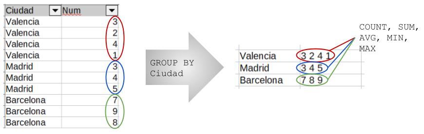

# a1. Proyección, filtrado, ordenación, agregación   

Crea una base de datos con la siguiente tabla:

```sql
create table empleados(
    id_empleado     serial,
    nombre          text,
    apellido        text,
    departamento    text,
    puesto          text,
    salario         numeric,
    fecha_contrato  date,
    ciudad          text,
    edad            integer
);
```

Inserta diversos emplados:

```sql
INSERT INTO empleados (nombre, apellido, departamento, puesto, salario, fecha_contrato, ciudad, edad) VALUES
('Ana',     'García',   'Ventas',     'Vendedor',       1800, '2018-03-15', 'Madrid',     29),
('Luis',    'Pérez',    'Ventas',     'Jefe Ventas',    2500, '2015-07-01', 'Valencia',   41),
('Marta',   'López',    'Marketing',  'Analista',       2200, '2020-01-20', 'Sevilla',    33),
('Carlos',  'Ruiz',     'IT',         'Programador',    2000, '2019-11-11', 'Madrid',     26),
('Sofía',   'Torres',   'IT',         'Administrador',  2100, '2016-09-05', 'Barcelona',  39),
('Diego',   'Fernández','RRHH',       'Técnico',        1700, '2021-04-10', 'Valencia',   28),
('Lucía',   'Martín',   'IT',         'Programador',    1950, '2017-02-14', 'Sevilla',    31),
('Pablo',   'Santos',   'Ventas',     'Vendedor',       1850, '2022-08-01', 'Madrid',     24),
('Elena',   'Díaz',     'Marketing',  'Diseñador',      1900, '2019-05-23', 'Valencia',   30),
('Javier',  'Moreno',   'Ventas',     'Vendedor',       1750, '2018-10-10', 'Barcelona',  27),
('Raquel',  'Ramírez',  'IT',         'Programador',    2050, '2021-12-01', 'Madrid',     25),
('Tomás',   'Vidal',    'IT',         'Administrador',  2150, '2014-06-18', 'Sevilla',    44),
('Clara',   'Navas',    'RRHH',       'Jefe RRHH',      2400, '2013-09-09', 'Madrid',     45),
('Sergio',  'Gómez',    'Marketing',  'Analista',       2250, '2022-03-15', 'Barcelona',  29),
('Laura',   'Suárez',   'Ventas',     'Vendedor',       1900, '2016-07-25', 'Valencia',   37),
('Andrés',  'Ortega',   'IT',         'Programador',    2100, '2020-08-30', 'Madrid',     32),
('Patricia','Castro',   'Marketing',  'Diseñador',      1850, '2017-04-12', 'Sevilla',    34),
('Fernando','Blanco',   'IT',         'Jefe IT',        2800, '2012-11-05', 'Barcelona',  50),
('Isabel',  'Serrano',  'RRHH',       'Técnico',        1750, '2019-01-16', 'Madrid',     27),
('David',   'Iglesias', 'Ventas',     'Vendedor',       1800, '2021-09-21', 'Sevilla',    23);
```

🔎 Realiza las siguientes consultas:

1. Todos los datos de todos los empleados
1. Los nombres y apellidos de todos los empleados
1. El nombre, departamento y salario de cada empleado
1. Los departamentos, eliminando duplicados
1. Las ciudades, ordenadas 
1. Los departamentos que tiene cada ciudad
1. Los empleados del departamento `IT`
1. Los empleados que trabajan en `Valencia`
1. Los empleados con un salario mayor a `2000`
1. Los empleados con edad entre `25` y `35`
1. Los empleados contratados después del `1 de enero de 2020`
1. Los empleados cuyo apellido empiece por la letra `G`
1. Los empleados que tengan el puesto de `Programador` o `Administrador`
1. Las ciudades que tengan algún `Jefe`
1. Los empleados de `Madrid` y `Barcelona` contratados después del `1 de enero de 2020`
1. Los empleados que **no** pertenecen al departamento `Ventas`
1. Nombre y apellidos de los empleados con el apellido posterior a `García`
1. Los `5` empleados con el salario más alto
1. Los siguientes `5` empleados con el salario más alto
1. Los `5` empleados con el salario más bajo
1. Los `3` empleados más jovenes que trabajen en `IT` o `Marketing`
1. Los `5` empleados contratados entre `2015` y `2020`, que hayan sido contratados más recientemente
1. Los empleados cuyo salario esté entre `1800` y `2200`, y que trabajen en `Madrid` o `Barcelona`
1. Los empleados cuyo apellido termine en `ez` y ordena por salario descendente. Muestra solo el segundo resultado
1. Los `3` empleados con mayor edad que **no** trabajen en el departamento de `Ventas`
1. Los empleados con nombre de más de `5` caracteres y ordena primero por departamento ascendente y luego por edad descendente
1. Los empleados que tengan un salario superior a `2000` y cuya edad no esté entre `30` y `40` años. Ordénalos de menor a mayor salario y muestra solo los dos primeros
1. Los empleados de `Sevilla` y `Valencia` cuyo puesto contenga la palabra `Vendedor` o `Programador`
1. Los empleados con edad impar (`edad % 2 = 1`), ordénalos de mayor a menor edad y muestra el empleado en la posición `4`
1. Los `5` empleados con salario más bajo, excluyendo a los que trabajan en `Madrid`
1. Los empleados que trabajan en `IT` o `Ventas`, tienen un salario entre `1800` y `2200`, su edad está entre `25` y `40`, y trabajan en `Madrid`, `Barcelona` o `Valencia`
1. El salario medio de todos los empleados
1. El salario medio de los empleados de `Valencia`
1. La suma de salarios de los empleados de `IT`
1. El salario más alto
1. El salario más bajo de `Valencia`
1. El empleado con el salario más alto
1. El empleado con el salario más bajo de `Valencia`
1. Número de empleados por departamento
1. Número de empleados por ciudad
1. Salario medio por departamento
1. Salario máximo por ciudad
1. Edad media de los empleados por departamento
1. Número de empleados por puesto, ordenados de mayor a menor
1. Salario medio por ciudad, mostrando solo aquellas ciudades con salario medio superior a `2000`
1. Número de empleados por departamento, mostrando solo los que tengan más de `3` empleados
1. Salario medio por departamento, ordenado descendentemente y mostrando solo el salario medio
1. La suma de salarios por ciudad y departamento
1. Número de empleados por departamento y ciudad, mostrando solo los casos donde haya más de `1` empleado en esa combinación
1. Salario máximo y mínimo por departamento
1. Edad media por departamento, mostrando solo aquellos departamentos donde la edad media sea mayor a `35`
1. Los departamentos que tengan al menos un empleado contratado después de `2020-01-01` y con salario superior a `2000`
1. Salario medio por puesto, mostrando solo los puestos cuyo salario medio sea mayor que el salario medio global de todos los empleados
1. Los empleados cuyo salario sea mayor que el salario medio de todos los empleados
1. Los empleados que trabajan en el mismo departamento que `Ana García`
1. Los empleados que tienen el mismo puesto que el empleado con id_empleado igual a `5`
1. Los empleados cuyo salario sea igual al salario máximo del departamento de `IT`
1. Los empleados que trabajan en la misma ciudad que `Luis Pérez` o `Pablo Santos`
1. Nombre y salario de los empleados que ganan más que la media de su propio departamento
1. Empleados cuyo salario sea mayor que el salario medio de la ciudad en la que trabajan
1. Empleados que tengan un salario superior al del empleado más joven de la empresa
1. Empleados cuya fecha de contrato sea posterior a la fecha de contrato del empleado con mayor salario
1. Empleados que trabajan en departamentos que tengan al menos un `Jefe`
1. Empleados que ganan más que el segundo salario más alto de la empresa
1. Empleados que trabajan en la ciudad con más empleados
1. Empleados cuyo salario sea superior al salario máximo de al menos un departamento distinto al suyo
1. Empleados que trabajan en departamentos cuyo salario medio es mayor que el salario medio global de la empresa
1. Nombre y apellido de los empleados que tienen el mismo salario que otro empleado de un departamento distinto

<br />

## 📖 Referencia

### 1. 🔹 Sintaxis general de una consulta

```sql
SELECT [DISTINCT] campos
FROM tabla
[WHERE condiciones]
[GROUP BY campos]
[HAVING condiciones]
[ORDER BY campos [ASC|DESC]]
[LIMIT cantidad]
[OFFSET inicio];
```

### 2. 🔹 Selección de datos (SELECT)

`SELECT *` → devuelve todas las columnas.

`SELECT columna1, columna2` → devuelve solo esas columnas.

`SELECT DISTINCT columna` → elimina duplicados.

👀 Ejemplo:

```sql
SELECT nombre, apellido FROM empleados;
SELECT DISTINCT departamento FROM empleados;
```

### 3. 🔹 Filtrado de filas (WHERE)

Sirve para establecer condiciones:

Comparaciones:

```sql
=   !=   >   <   >=    <=
```

Rango:
```sql 
BETWEEN valor1 AND valor2
```

Conjunto:

```sql
IN (valores)
```

Patrones:

```sql
LIKE 'A%' (empieza por A)
LIKE '%z' (termina en z)
LIKE '%rr%' (contiene “rr”)
```

👀 Ejemplo:

```sql
SELECT * FROM empleados WHERE salario > 2000;
SELECT * FROM empleados WHERE apellido LIKE 'G%';
```

### 4. 🔹 Ordenación (ORDER BY)

Ordena los resultados por una o más columnas.

`ASC` → ascendente (por defecto).

`DESC` → descendente.

👀 Ejemplo:

```sql
SELECT nombre, salario
FROM empleados
ORDER BY salario DESC;
```

### 5. 🔹 Limitación de resultados (LIMIT y OFFSET)

`LIMIT n` → muestra solo los primeros `n` resultados.

`OFFSET m` → salta los `m` primeros resultados.

👀 Ejemplo:

```sql
-- Los 5 salarios más altos
SELECT nombre, salario
FROM empleados
ORDER BY salario DESC
LIMIT 5;

-- Los siguientes 5 salarios más altos
SELECT nombre, salario
FROM empleados
ORDER BY salario DESC
LIMIT 5 OFFSET 5;
```

### 6. 🔹 Operadores lógicos

`AND` → ambas condiciones deben cumplirse.

`OR` → al menos una condición se cumple.

`NOT` → niega la condición.

👀 Ejemplo:

```sql
SELECT * 
FROM empleados
WHERE ciudad IN ('Madrid', 'Barcelona')
  AND fecha_contrato > '2020-01-01';
```

### 7. 🔹 Funciones de agregación (reducción)

Se aplican sobre grupos de filas y devuelven un único valor:

`COUNT(*)` → cuenta filas.

`SUM(columna)` → suma valores.

`AVG(columna)` → media.

`MIN(columna)` → mínimo.

`MAX(columna)` → máximo.

👀 Ejemplo:

```sql
SELECT departamento, AVG(salario) AS salario_medio
FROM empleados
GROUP BY departamento;
```

### 8. 🔹 Agrupación (GROUP BY)

Agrupa filas según los valores de una o varias columnas.



👀 Ejemplo:

```sql
SELECT ciudad, COUNT(*) AS empleados_por_ciudad
FROM empleados
GROUP BY ciudad;
```

### 9. 🔹 Filtro sobre grupos (HAVING)

Sirve para filtrar resultados después de agrupar (a diferencia de WHERE, que filtra filas antes del GROUP BY).

👀 Ejemplo:

```sql
-- Ciudades con salario medio superior a 2000
SELECT ciudad, AVG(salario) AS salario_medio
FROM empleados
GROUP BY ciudad
HAVING AVG(salario) > 2000;
```

### 10. 🔹 Subconsultas

Una consulta dentro de otra.

👀 Ejemplo:

```sql
-- Puestos con salario medio superior al global
SELECT puesto, AVG(salario)
FROM empleados
GROUP BY puesto
HAVING AVG(salario) > (SELECT AVG(salario) FROM empleados);
```

### 11. 🔹 Funciones de cadenas y cálculo

`LENGTH(cadena)` → longitud de un texto.

`||` → concatenación de cadenas.

`edad % 2 = 1` → comprobar si un número es impar.

👀 Ejemplo:

```sql
-- Empleados con nombre largo
SELECT nombre, LENGTH(nombre) AS longitud
FROM empleados
WHERE LENGTH(nombre) > 5;
```


